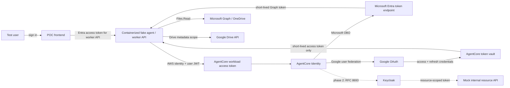

# AgentCore Identity Auth Broker POC Design

**Status:** Proposed for internal architecture review  
**Date:** 2026-08-15  
**Audience:** AI platform engineers responsible for the IIG Studio EKS platform and its supporting services

## 1. Decision to make

Determine whether Amazon Bedrock AgentCore Identity is suitable as the credential broker for IIG-hosted agents.

The POC must show whether an externally hosted agent workload can:

1. present a stable AgentCore workload identity;
2. accept an access token for an authenticated end user;
3. obtain short-lived, user-delegated tokens for downstream services;
4. keep OAuth client secrets and user refresh tokens out of the agent, Temporal workflow state, logs, and the IIG credential store; and
5. preserve enough user and workload context for IIG and downstream services to make authorization decisions.

The initial implementation runs in a personal AWS account with low-cost or free identity providers. It is designed to answer a product-suitability question, not to reproduce the production EKS platform.

## 2. Decision boundaries

### In scope

- Microsoft Entra ID as the inbound identity provider and free stand-in for the shape of an IIG user token.
- AgentCore `GetWorkloadAccessTokenForJWT` for binding the inbound user to a stable workload identity.
- AgentCore Microsoft OAuth credential provider and Microsoft OBO exchange for Microsoft Graph.
- Tenant-wide Entra admin consent so that users do not approve Microsoft Graph permissions individually.
- AgentCore Google OAuth credential provider and token vault for Google Drive.
- A containerized frontend and worker API that can later be deployed to EKS without changing the identity-flow boundaries.
- A later Keycloak phase to exercise AgentCore's custom RFC 8693 token-exchange support and a mock internal resource API.
- Evidence collection for token ownership, expiry, refresh, isolation, failure behavior, and authorization.

### Out of scope

- Production PingOne and AD FS integration.
- Production EKS, Temporal, ingress, service mesh, observability, or multi-region deployment.
- Selecting the final policy engine for AD-group authorization.
- Indexing, copying, or persisting document content.
- Broad Microsoft Graph or Google Drive permissions beyond listing file metadata.
- Proving that Keycloak exactly reproduces PingOne or AD FS behavior.

## 3. Hypotheses and pass criteria

The assessment records each hypothesis separately. AgentCore should not receive an overall "pass" when only one flow works.

| ID | Hypothesis | Pass evidence |
| --- | --- | --- |
| H1 | An external worker can combine its AWS-authorized workload identity with an Entra user JWT. | AgentCore returns a workload access token for the configured workload; a missing/invalid AWS identity, invalid user JWT, wrong issuer, or expired JWT fails closed. |
| H2 | AgentCore can exchange the user context for a Microsoft Graph delegated token without per-user consent. | After one tenant-admin grant, two test users list only the OneDrive files each can access, with no Microsoft consent prompt during normal use. |
| H3 | AgentCore can own a third-party user's durable OAuth credential. | After one Google authorization, the worker lists Drive file metadata, continues after the initial access token expires, and contains no Google refresh token or client secret. |
| H4 | Credentials are isolated by both user and workload. | User A cannot retrieve User B's credential, and an unapproved workload cannot retrieve either user's credential. |
| H5 | AgentCore can broker a token for a custom internal-style OAuth resource. | In phase 2, AgentCore exchanges a Keycloak token for a token with the mock resource's audience and limited scope; invalid audiences and unauthorized clients fail. |
| H6 | Authorization remains enforceable outside AgentCore Identity. | Microsoft Graph enforces native file ACLs; the mock resource accepts or rejects requests using token claims and policy without relying on AgentCore as the policy decision point. |

## 4. Proposed system

The worker is intentionally external to AgentCore Runtime. This matches the production question: an IIG-hosted Temporal worker on EKS must be able to use AgentCore Identity without moving the agent runtime into AgentCore.

For the personal-account phase, the frontend and worker run locally in containers. The worker uses an AWS development profile with a least-privilege IAM policy. The production mapping replaces that profile with an EKS Pod Identity or IRSA role; the application protocol remains unchanged.

## 5. Component responsibilities

### POC frontend

- Authenticates a test user with Entra using authorization code flow with PKCE.
- Requests an access token whose audience is the worker API, not Microsoft Graph.
- Calls only the worker API.
- Displays Microsoft 365 and Google Drive as separate sources because their consent behavior differs.
- Redirects the user through Google authorization only when AgentCore reports that no Google credential exists.
- Never receives downstream access tokens, refresh tokens, OAuth client secrets, or AWS credentials.

### Fake agent / worker API

- Validates the inbound Entra access token before accepting a request.
- Calls `GetWorkloadAccessTokenForJWT` with the exact inbound JWT and configured AgentCore workload name.
- Requests a provider token from AgentCore for one declared provider and least-privilege scope.
- Uses the returned short-lived token immediately to call Microsoft Graph or Google Drive.
- Returns normalized file metadata only: provider, identifier, name, type, and modified time.
- Redacts authorization headers, tokens, authorization URLs, and secrets from application logs.
- Does not persist any user credential.

### AgentCore Identity

- Validates and binds the user JWT to the workload identity.
- Stores Microsoft and Google OAuth client credentials.
- Performs Microsoft OBO exchange using the inbound user context.
- Orchestrates Google three-legged OAuth and stores/refreshes the durable Google credential.
- Releases downstream access tokens only to an authorized workload acting for the bound user.

### Microsoft Entra ID and Graph

- Entra issues the frontend's access token for the worker API.
- A tenant administrator grants the POC app the delegated Microsoft Graph `Files.Read` permission once.
- Entra makes the OBO authorization decision and issues the Graph token.
- Graph enforces the user's OneDrive permissions. AgentCore does not expand them.

`Files.Read` is preferred over `Files.Read.All`. The implementation may add `User.Read` only if the selected Graph call requires it.

### Google OAuth and Drive

- Google asks the user for consent because an Entra administrative grant cannot authorize access to a Google account.
- The POC requests `https://www.googleapis.com/auth/drive.metadata.readonly`.
- AgentCore owns the resulting refresh token and supplies short-lived access tokens to the worker.
- Drive enforces the Google user's native permissions.

### Keycloak and mock internal resource API (phase 2)

- Keycloak provides a freely available RFC 8693-capable authorization server.
- A confidential requester client represents AgentCore's credential provider.
- A target client/audience represents an internal resource service.
- The mock API validates issuer, signature, audience, expiry, and required scope or group claim.
- This phase proves the custom-provider protocol shape. A production PingOne/AD FS compatibility decision still requires tests against those actual products.

## 6. Token flows

### 6.1 Entra to Microsoft Graph

1. The user signs in to the POC frontend.
2. Entra issues an access token for the worker API.
3. The frontend calls the worker with that token.
4. The worker validates the token and asks AgentCore for a workload access token using `GetWorkloadAccessTokenForJWT`.
5. AgentCore binds the Entra `iss` and `sub` to the configured workload.
6. The worker requests `ON_BEHALF_OF_TOKEN_EXCHANGE` for the Microsoft provider and Graph `Files.Read` scope.
7. AgentCore submits the inbound user context plus the stored confidential-client credential to Entra.
8. Entra returns a Graph access token; AgentCore returns the short-lived token to the worker.
9. The worker calls Graph and discards the token after the request.

This path must not trigger an end-user Microsoft consent prompt after tenant-wide admin consent has been granted.

### 6.2 Entra user to Google Drive

1. The user signs in to the frontend with Entra and requests Google Drive.
2. The worker obtains the Entra-user/workload binding from AgentCore.
3. If no Google credential is bound to that user and workload, AgentCore returns an authorization URL.
4. The frontend redirects the user to Google.
5. Google obtains the user's consent and returns the authorization response to AgentCore's provider-specific callback.
6. AgentCore stores the Google refresh token in its vault.
7. The worker requests a Google access token and lists Drive metadata.
8. A later request demonstrates automatic refresh without another Google authorization and without a durable credential in the worker.

This flow proves credential vaulting and refresh, not cross-provider OBO or zero consent.

### 6.3 Keycloak to mock internal resource

1. A test user authenticates to a Keycloak client representing the IIG frontend/API.
2. The worker passes the inbound Keycloak token through AgentCore workload binding.
3. AgentCore's custom provider submits an RFC 8693 token-exchange request as a confidential client.
4. Keycloak issues a token for the mock resource audience with a reduced scope.
5. The mock API validates the token and applies claim-based authorization.

The first Keycloak implementation uses supported internal-to-internal standard token exchange. Cross-domain chaining and external-token import are separate production risks and are not inferred from this result.

## 7. Trust boundaries and credential ownership

| Asset | Owner at rest | May be visible to worker | Must never reach frontend |
| --- | --- | --- | --- |
| Entra user access token for worker API | Frontend session storage or memory | Yes, as inbound request credential | No other user's token |
| AgentCore workload access token | Worker memory | Yes | Yes |
| Graph access token | Worker memory for immediate call | Yes | Yes |
| Google access token | Worker memory for immediate call | Yes | Yes |
| Google refresh token | AgentCore token vault | No | Yes |
| Microsoft/Google OAuth client secrets | AgentCore/Secrets Manager | No | Yes |
| AWS workload credentials | Local AWS credential mechanism; EKS role in production | SDK use only | Yes |

Short-lived access tokens necessarily enter worker memory because the worker calls the downstream API. The product claim is therefore not "the worker sees no credentials"; it is "the worker does not own durable user credentials or OAuth client secrets."

## 8. Authorization model

AgentCore Identity is a credential broker, not the system of record for authorization.

- IIG decides whether a source is enabled for a tenant and whether a user may invoke the source.
- Entra/PingOne group claims may be used by an IIG policy layer, subject to claim-size and group-overage handling.
- The downstream authorization server decides whether the requested delegation and scopes are allowed.
- Microsoft Graph, Google Drive, and internal resource servers enforce resource-level access.
- AgentCore scopes credential retrieval by workload and user; it must not be treated as a replacement for those policy decisions.

The POC records group claims but does not select Cedar, OPA, AgentCore Policy, or an application-specific policy engine. That decision belongs to the EKS platform architecture.

## 9. Failure behavior

The UI and API expose stable error categories without returning provider tokens or raw provider responses.

| Condition | Expected behavior |
| --- | --- |
| Missing, invalid, or expired inbound JWT | Worker returns 401 and does not call AgentCore. |
| JWT from an unconfigured issuer or audience | Worker returns 401; event is audit logged without the token. |
| Workload lacks IAM permission | AgentCore request fails; worker returns 503/identity-broker-unavailable rather than falling back to shared credentials. |
| User lacks provider consent or credential | Worker returns a typed `authorization_required` response; only the provider authorization URL is allowed. |
| User cancels consent | Source remains disconnected; no retry loop. |
| Downstream scope or ACL denies access | Worker returns 403 with a provider-neutral denial code. |
| Provider is unavailable or throttles | Worker applies bounded retries for idempotent list calls and returns 503/429 with correlation ID. |
| Token expires during downstream call | Worker obtains one fresh token from AgentCore and retries once. |
| Credential is revoked | AgentCore/provider failure becomes `authorization_required`; the worker never attempts to use a stored fallback token. |

## 10. Security controls

- Least-privilege IAM permits only the required AgentCore data-plane operations for named workload/provider resources where resource scoping is supported.
- OAuth client secrets are entered directly into AgentCore or referenced from Secrets Manager; they are never committed.
- Repository examples use `.env.example` with non-secret placeholders.
- Application logs record correlation IDs, provider name, user hash, workload name, result, and latency; token values and authorization headers are redacted.
- Browser tokens use authorization code flow with PKCE and are not persisted in local storage unless testing proves a compelling need.
- CORS is restricted to the configured frontend origin.
- Provider callbacks and return URLs use exact allowlists.
- Tests include cross-user and cross-workload credential-access attempts.
- Cleanup instructions revoke provider grants and delete AgentCore credential providers, workload identities, AWS secrets, and test app registrations.

## 11. Test strategy

### Automated tests

- JWT validation: valid token, expiry, issuer, audience, signature, and missing claims.
- Provider abstraction: Graph and Drive responses normalize to the same metadata contract.
- Redaction: representative tokens and secrets never appear in logs or error payloads.
- Error mapping: provider/AWS errors map to the documented stable categories.
- Authorization: the mock internal API accepts the intended audience/scope and rejects wrong-user, wrong-audience, expired, and insufficient-scope tokens.

AWS and provider clients are replaced with deterministic fakes in unit tests. No test fixture contains a real credential.

### Manual integration evidence

- Decode token headers and claims locally with values redacted; capture issuer, audience, subject hash, scopes, expiry, and actor/workload indicators where present.
- List OneDrive metadata as two users with different files and show distinct results.
- Show no Microsoft consent prompt after the one-time administrator grant.
- Connect Google once, wait for or force access-token expiry, and show a later successful request without another prompt.
- Search the repository, container filesystem, application state, Temporal-equivalent payloads, and logs for refresh tokens and client secrets.
- Attempt credential access from a second workload identity and record denial.
- Revoke a Google grant and show the source returns to `authorization_required`.

Evidence committed to the repository must be sanitized. Screenshots, logs, and decoded claims must not contain tokens, tenant secrets, user email addresses, drive filenames, or stable personal identifiers.

## 12. Personal-account prerequisites and fallbacks

- Personal AWS account in a region supporting the required AgentCore Identity operations.
- Microsoft Entra tenant where the tester can register apps and grant tenant-wide admin consent.
- A work/school test identity with an available OneDrive workload for the full Graph file-list test.
- Google Cloud project and one or more OAuth test users.
- Docker and a current Python and Node.js toolchain.

Entra Free provides the identity and app-registration layer, but it should not be assumed to include a licensed OneDrive workload. If OneDrive is unavailable, phase 1 first validates Microsoft OBO with a low-privilege Graph call available to the test identity or with a custom Entra-protected test API. The OneDrive-specific H2 result remains "not tested" until a licensed or otherwise eligible OneDrive test account is available; it must not be marked passed by inference.

The Google OAuth app remains in testing mode and uses explicit test users to avoid a public verification exercise.

## 13. Production mapping

| POC | IIG production candidate |
| --- | --- |
| Local containerized worker | Temporal activity/worker pod on EKS |
| AWS development profile | EKS Pod Identity or IRSA role scoped to workload/provider |
| Entra inbound token | PingOne token federated from Entra/on-prem AD |
| Entra groups | PingOne-transformed AD group/role claims |
| Microsoft OBO provider | Tenant-approved IIG Microsoft 365 enterprise application |
| Google test OAuth app | Centrally approved IIG Google Workspace OAuth app |
| Keycloak RFC 8693 | PingOne RFC 8693 or supported AD FS/PingOne delegation path |
| Mock internal API | Internal API validating PingOne or AD FS tokens |
| Local process logs | Central audit/observability platform with token redaction |

The POC reduces uncertainty about AgentCore APIs and credential custody. It does not remove the need for a production spike with real PingOne tokens, actual PingOne token-exchange policy, AD FS behavior where applicable, EKS IAM, enterprise network controls, and the chosen authorization policy layer.

## 14. Deliverables after approval

The implementation plan will add:

- a repository-level README for reviewers;
- architecture, assessment, runbook, and production-mapping documents derived from this specification;
- a phase 1 plan for Entra, Microsoft Graph, and Google Drive;
- a phase 2 plan for Keycloak and the mock internal resource;
- a small containerized frontend and worker implementation with tests; and
- infrastructure-as-code or repeatable CLI configuration for AWS and provider resources, chosen during implementation planning.

## 15. References

- [AgentCore: get a workload access token](https://docs.aws.amazon.com/bedrock-agentcore/latest/devguide/get-workload-access-token.html)
- [AgentCore: on-behalf-of token exchange](https://docs.aws.amazon.com/bedrock-agentcore/latest/devguide/on-behalf-of-token-exchange.html)
- [AgentCore: configure credential providers](https://docs.aws.amazon.com/bedrock-agentcore/latest/devguide/resource-providers.html)
- [AgentCore: Google OAuth provider](https://docs.aws.amazon.com/bedrock-agentcore/latest/devguide/identity-idp-google.html)
- [Microsoft: delegated permissions and consent](https://learn.microsoft.com/en-us/entra/identity-platform/permissions-consent-overview)
- [Microsoft Graph permissions reference](https://learn.microsoft.com/en-us/graph/permissions-reference)
- [Google Drive OAuth scopes](https://developers.google.com/workspace/drive/api/guides/api-specific-auth)
- [Keycloak: standard token exchange](https://www.keycloak.org/securing-apps/token-exchange)

