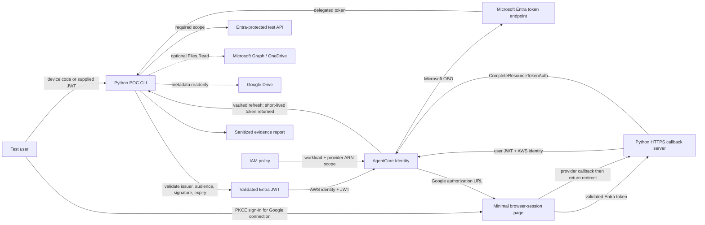

# AgentCore Identity Auth Broker POC Design

**Status:** Revised after architecture review
**Date:** 2026-08-15
**Audience:** AI platform engineers responsible for the IIG Studio EKS platform and its supporting services

## 1. Decision to make

Determine whether Amazon Bedrock AgentCore Identity is suitable as the credential broker for IIG-hosted agents.

The POC must show whether an externally hosted agent workload can:

1. present a stable AgentCore workload identity;
2. accept and validate an access token for an authenticated end user;
3. obtain short-lived, user-delegated tokens for downstream services;
4. keep OAuth client secrets and user refresh tokens out of the agent, Temporal workflow state, logs, and the IIG credential store;
5. isolate vaulted credentials by user and use IAM to isolate access by workload;
6. survive or explicitly reject work that outlives its inbound user token; and
7. preserve enough evidence for authorization, offboarding, and audit decisions.

The implementation runs from a developer machine in a personal AWS account. It is a feasibility experiment, not a demonstration application and not a reproduction of the production EKS platform.

## 2. Decision boundaries

### In scope

- A Python CLI that obtains or accepts an Entra access token, calls AgentCore Identity, invokes test resources, and writes sanitized evidence.
- A minimal Python HTTPS callback server and browser-session bootstrap for AgentCore OAuth session binding. It has no general-purpose frontend.
- Microsoft Entra ID as the inbound identity provider and a free stand-in for the shape of an IIG user token.
- AgentCore `GetWorkloadAccessTokenForJWT` for binding a validated inbound JWT to a stable workload identity.
- AgentCore Microsoft OAuth credential provider and Microsoft OBO exchange.
- A custom Entra-protected test API as the primary OBO target; Microsoft Graph and OneDrive are optional confirmation targets.
- AgentCore Google OAuth credential provider, session-binding callback, token vault, and Google Drive metadata access.
- User isolation, IAM-enforced workload isolation, inbound-token expiry, credential revocation, offboarding, auditability, latency, caching, and throttling evidence.
- A paper compatibility assessment mapping PingOne and AD FS to AgentCore's custom OAuth provider configuration.
- A baseline comparison between AgentCore and a small direct implementation using MSAL plus an encrypted credential store.

### Out of scope

- A SPA, polished application frontend, Node.js toolchain, or application containers. The small same-origin page required to establish the callback's live browser session remains in scope.
- Production PingOne and AD FS integration.
- Production EKS, Temporal, ingress, service mesh, observability, load testing, or multi-region deployment.
- Selecting the final policy engine for AD-group authorization.
- Indexing, copying, or persisting document content.
- Broad Microsoft Graph or Google Drive permissions beyond low-risk test scopes.
- A live Keycloak environment unless the paper compatibility assessment leaves a specific protocol question unresolved.
- Proving that a stand-in identity provider exactly reproduces PingOne or AD FS behavior.

## 3. Hypotheses and pass criteria

The assessment records each hypothesis separately. AgentCore does not receive an overall pass because one flow works.

| ID | Hypothesis | Pass evidence |
| --- | --- | --- |
| H1 | An external worker can combine its AWS-authorized workload identity with a valid Entra user JWT. | The CLI validates issuer, audience, signature, expiry, and required claims before AgentCore; a valid token produces a workload access token, while invalid tokens are rejected locally and a missing or unauthorized AWS identity is rejected by AWS. |
| H2 | AgentCore can exchange the user context for a delegated Entra token without a normal-use consent prompt. | The same Entra API app registration is used as the inbound token audience and confidential OBO client. After admin consent and client pre-authorization, two users call the custom test API through OBO without a prompt. OneDrive is optional additional evidence. |
| H3 | AgentCore can own and refresh a third-party user's durable OAuth credential. | After one Google authorization and successful `CompleteResourceTokenAuth`, the CLI lists Drive metadata after the initial access token expires without another prompt and without receiving a Google refresh token or client secret. |
| H4a | AgentCore's credential vault isolates credentials by user identity. | A workload access token for User A cannot retrieve User B's vaulted Google credential. |
| H4b | Workload isolation can be enforced with IAM, and is not incorrectly attributed to AgentCore. | Using the same IAM principal, a deliberately broad resource policy allows a second workload name to reach the provider; replacing it with named workload-identity and provider ARNs denies that access while preserving the approved workload's access. |
| H5 | AgentCore's custom-provider configuration plausibly fits PingOne and AD FS. | A documented field-by-field mapping covers discovery, grant, client authentication, actor-token, scope, audience, and custom-parameter requirements. Any unmapped production behavior is reported as a blocker rather than inferred from Keycloak. |
| H6 | Authorization remains enforceable outside AgentCore Identity. | The custom API accepts only the intended issuer, audience, expiry, subject, and scope. Optional Graph/Drive calls show that downstream ACLs remain authoritative. |
| H7 | Behavior under inbound-token expiry is understood. | The POC records OBO behavior with an expired inbound Entra JWT, the observed workload-access-token lifetime, and whether an existing workload access token can obtain another downstream token after its source JWT expires. Google vault behavior is recorded separately. |
| H8 | A user's vaulted credential can be revoked and offboarded. | Provider-side revocation is detected by the downstream call even if AgentCore returns a cached token. The POC tests `forceAuthentication`, identifies the narrowest available AgentCore deletion operation for one user's credential, and fails H8 if no acceptable per-user purge path exists. |

## 4. Decision rule

### Adopt candidate

AgentCore is an adoption candidate only if H1, H2, H3, H4a, H6, H7, and H8 pass, and the IAM model demonstrated by H4b is acceptable to the platform and security teams. H5 must be plausible for the intended production provider or the production custom-provider path is rejected. Optional Graph and Drive resource-specific results may remain not tested if licensing or test data is unavailable.

### Adopt with caveats

Use this outcome when the mandatory hypotheses pass but production adoption requires accepted controls such as one IAM role per workload/provider set, a public session-binding callback, re-consent during issuer migration, or retry/re-entry behavior for long-running workflows. Each caveat must have an owner and a production validation action.

### Reject or defer

Reject or defer AgentCore when any mandatory flow fails, per-user offboarding is unacceptable, inbound-token expiry makes the intended Temporal workflow unsupportable, required audit attribution is absent, or the measured latency/quota profile cannot meet the expected production shape. Failure of custom PingOne or AD FS compatibility rejects that production integration path, not the already-tested Microsoft or Google paths.

## 5. Proposed system

The CLI is intentionally external to AgentCore Runtime. This matches the production question: an IIG-hosted Temporal worker on EKS must be able to use AgentCore Identity without moving agent execution into AgentCore Runtime.

The browser is used for interactive Entra authentication and Google consent. For the Google path, a small same-origin page obtains an Entra token with authorization code and PKCE, keeps it only in `sessionStorage`, and supplies it to the callback service before and after the Google redirect. The callback server exists solely because AgentCore requires the application to bind the Google authorization session to the currently authenticated user before vaulting the credential.

## 6. Component responsibilities

### Python CLI

- Provides explicit commands for preflight checks, Entra OBO, Google authorization, Google retrieval, isolation tests, expiry tests, operational measurements, cleanup, and report generation.
- Uses Entra device-code flow for the normal POC path, with an explicit option to accept a short-lived token supplied through a protected runtime input for negative and expiry tests.
- Validates inbound Entra tokens against pinned tenant issuer and worker-API audience before calling AgentCore.
- Calls `GetWorkloadAccessTokenForJWT` with the exact validated JWT and configured workload name.
- Requests one declared provider and least-privilege scope at a time.
- Calls downstream APIs using returned short-lived tokens and then discards the tokens.
- Emits structured, sanitized observations rather than raw tokens, authorization headers, filenames, email addresses, or stable personal identifiers.
- Does not persist any user credential.

### Callback server

- Exposes one publicly reachable HTTPS return URL registered as an `AllowedResourceOauth2ReturnUrl` on the workload identity.
- Serves a minimal same-origin page that authenticates the user to Entra with authorization code and PKCE for the same API audience used by the CLI. The page keeps the resulting token in browser `sessionStorage`, never `localStorage`, and removes it after completion or terminal failure.
- Accepts that live browser token at the start of Google connection, validates it, obtains the workload token, requests the Google authorization URL, and binds an opaque one-time `state` value in a signed, short-lived, `HttpOnly`, `Secure`, `SameSite=Lax` cookie.
- Receives AgentCore's return redirect, checks the state cookie and session URI, and serves the completion page. The page reads the still-live Entra token from `sessionStorage` and posts it to the same-origin completion endpoint.
- Revalidates the token and calls `CompleteResourceTokenAuth` with that user token. It does not recover the user identifier from a remote server-side session cache.
- Deletes the state cookie and browser token after success or terminal failure and never logs their contents.
- Returns only a minimal success or failure page instructing the tester to return to the CLI.

The POC first uses `agentcore dev` as a provider/vault smoke test if useful, then repeats the flow with this callback server through a public HTTPS tunnel. Only the second run proves the callback responsibility relevant to EKS.

### Entra-protected test API

- Exposes one read-only endpoint returning synthetic, non-personal data.
- Validates issuer, signature, audience, expiry, subject, and required delegated scope.
- Produces a stable allow/deny response suitable for sanitized evidence.
- Does not rely on AgentCore as its policy decision point.

### AgentCore Identity

- Binds the JWT's `iss` and `sub` to the named workload after the CLI has applied the application's issuer and audience policy.
- Stores Microsoft and Google OAuth client credentials.
- Performs Microsoft OBO exchange using the inbound user context.
- Orchestrates Google three-legged OAuth and stores and refreshes the durable Google credential after session binding is completed.
- Returns short-lived downstream access tokens to an AWS-authorized caller acting for the bound user.
- Does not service-enforce a workload-to-provider authorization relationship beyond the caller's IAM permissions.

### Provider configuration

- The Entra API app is both the exposed worker-API resource and the confidential middle-tier client used by AgentCore for OBO. The CLI client requests that API's delegated scope and is configured as a pre-authorized client.
- Tenant admin consent covers the downstream delegated scope. Pre-authorization of the CLI client covers the separate consent relationship for the worker API's own scope.
- The primary OBO target is the custom Entra-protected test API so the POC does not depend on a Microsoft 365 license. Graph `Files.Read` is optional.
- Google requests `https://www.googleapis.com/auth/drive.metadata.readonly` and sends `access_type=offline` during initial authorization so that Google can issue a refresh token. Google remains responsible for user consent and Drive remains responsible for native resource authorization.

## 7. Provisioning sequence

Provisioning is repeatable but not fully unattended because Google requires a callback URL that AgentCore generates only after provider creation.

1. Choose and pin an AgentCore-supported AWS region. Create a budget alarm before resources.
2. Create two AgentCore workload identities and an initial least-privilege IAM policy for the approved workload.
3. Configure the Entra API app, delegated scope, CLI public client, pre-authorization, downstream test API, and admin consent. The public-client registration supports device code and the browser bootstrap's authorization-code-with-PKCE redirect on the exact callback origin. Verify that the inbound token's `aud` is the same app whose confidential credential AgentCore uses for OBO.
4. Configure the AgentCore Microsoft provider and test the primary OBO path before Google work begins.
5. Create the Google project, consent screen, test users, and OAuth client with AgentCore's regional domain in Google's authorized domains. Leave the redirect URI empty initially.
6. Create the AgentCore Google credential provider, capture its unique `callbackUrl`, add that URL to Google, and update the provider with the final client configuration if placeholders were used.
7. Expose the local callback server through a temporary HTTPS tunnel and register its exact return URL on the workload identity.
8. Record generated resource identifiers in a local ignored state file for reruns and cleanup. Recreating the Google provider generates a new callback URL and requires repeating the Google console step.

The runbook must distinguish automated commands from the manual Google console operation rather than claiming a single idempotent apply.

### Execution stages and stop gates

1. **Preflight:** confirm region support, account permissions, SDK/API availability, Entra app topology, test users, Google project access, tunnel availability, quotas, and a budget alarm. Stop and report missing prerequisites rather than building around them.
2. **Entra OBO:** implement the CLI, JWT validation, workload-token acquisition, OBO exchange, and custom test API. Run H1, H2, and H6. If the basic OBO topology fails, stop before Google work and produce the failure evidence.
3. **Google vault and isolation:** add the minimal browser-session callback, provider setup, Drive metadata call, H3, H4a, H4b, H7, and H8. Do not add an application frontend.
4. **Assessment:** collect operational measurements, complete the PingOne/AD FS compatibility matrix and direct-implementation baseline, and apply the decision rule.

Each stage leaves the repository runnable and its evidence independently reviewable. Later stages do not turn a failed mandatory hypothesis into a pass by adding unrelated functionality.

## 8. Token flows

### 8.1 Entra OBO

1. The CLI acquires an Entra access token for the API app using device code, or accepts a deliberately supplied test token.
2. The CLI validates signature, pinned issuer, API audience, expiry, and required claims.
3. The CLI calls `GetWorkloadAccessTokenForJWT` with the validated token and approved workload name.
4. AgentCore keys the user context from the JWT issuer and subject and returns a workload access token.
5. The CLI requests `ON_BEHALF_OF_TOKEN_EXCHANGE` from the Microsoft provider for the downstream test API scope.
6. AgentCore submits the user assertion and stored confidential-client credential to Entra.
7. Entra returns a delegated downstream token. The CLI calls the test API and discards the token.

Issuer and audience rejection in step 2 is the CLI's security control. It must not be attributed to workload identity configuration, which has no trusted-issuer or allowed-audience field.

### 8.2 Google authorization and session binding

1. The Google-connect command opens the callback service's browser-session page. The page authenticates to Entra using authorization code and PKCE, obtains a token for the API app, and keeps it in `sessionStorage`.
2. The page posts that token to the callback service. The service validates it, obtains an Entra-user/workload binding, and requests a Google token with `access_type=offline`.
3. If no credential exists, AgentCore returns a Google authorization URL and session URI, valid for ten minutes. The callback service creates a signed, short-lived state cookie and redirects the same browser tab to Google.
4. The user grants consent at Google. Google redirects to AgentCore's provider-specific callback.
5. AgentCore redirects the browser to the registered POC callback with the authorization session identifier and opaque state.
6. The completion page posts the token from the live browser `sessionStorage` to the same-origin callback endpoint. The endpoint verifies state, revalidates the user token, and calls `CompleteResourceTokenAuth` using that token and the session URI.
7. Only after completion succeeds does AgentCore fetch and vault the Google credential.
8. The CLI requests the Google token again, lists Drive metadata, and discards the returned access token.
9. After the initial access token naturally expires, a later run demonstrates refresh without another prompt and without a durable credential entering the CLI.

The first `agentcore dev` smoke test does not count as proof of steps 3 through 6 because the development tool hosts and completes the callback on the application's behalf.

### 8.3 Expiry behavior

The POC treats the Microsoft OBO and Google vault paths as different products:

- For OBO, a fresh downstream token may require a still-valid inbound Entra assertion. The CLI records behavior before and after inbound-token expiry and never assumes a downstream retry can self-heal.
- For Google, AgentCore owns a refresh token after consent and is expected to refresh independently of the original Entra token used during connection. The POC records whether a valid user/workload context remains sufficient after the original token expires.
- A Temporal production design must reacquire user authorization, pause for interaction, or fail durably when the required live subject token no longer exists. The POC reports which branch is necessary; it does not invent a refresh credential for the inbound IdP.

## 9. Trust boundaries and credential ownership

| Asset | Owner at rest | Worker/CLI access | Browser access |
| --- | --- | --- | --- |
| Entra access token for API app | No durable POC storage | Held in memory for validation and exchange | Held in `sessionStorage` only during Google connection |
| AgentCore workload access token | No durable POC storage | Held in memory | None |
| Downstream Entra/Graph access token | No durable POC storage | Held for immediate call | None |
| Google access token | No durable POC storage | Held for immediate call | None |
| Google refresh token | AgentCore token vault | None | None |
| Microsoft/Google OAuth client secrets | AgentCore or approved secret input during provisioning | No runtime access | None |
| AWS credentials | Local AWS credential mechanism; EKS role in production | SDK use only | None |
| Callback CSRF state | Signed, short-lived browser cookie | Callback endpoint receives it | Current browser session only |

Short-lived access tokens necessarily enter CLI memory because it calls the downstream API. The product claim is not that the workload sees no credential; it is that the workload does not own durable user credentials or OAuth client secrets.

## 10. Authorization and identity model

AgentCore Identity is a credential broker, not the system of record for authorization.

- The CLI's JWT validator is the only POC control that restricts inbound issuer and audience before workload-token minting.
- AgentCore keys JWT-backed user identity by `iss` and `sub`. Changing the inbound issuer during migration creates a new vault identity and requires users to reconnect Google. Multiple inbound IdPs require an explicit namespace and collision analysis before production.
- Vaulted OAuth credentials are scoped to the user identity represented by the workload access token.
- Workload-to-provider access is enforced by IAM policies on the AWS principal, named workload-identity ARN, and named credential-provider ARN. AgentCore does not add a separate binding for identities in the same account.
- IIG decides whether a source is enabled and whether a user may invoke it. Entra or PingOne may carry group claims, subject to group-overage handling.
- The downstream authorization server decides whether delegation and scopes are allowed. Resource APIs enforce issuer, audience, scope, and resource-level access.

The POC records group claims but does not select Cedar, OPA, AgentCore Policy, or an application-specific policy engine.

## 11. Failure behavior

The CLI exposes stable error categories without printing provider tokens or raw provider responses.

| Condition | Expected behavior |
| --- | --- |
| Missing, invalid, expired, wrong-issuer, or wrong-audience inbound JWT | CLI rejects before AgentCore and records a sanitized validation failure. |
| AWS principal lacks permission | AgentCore request fails; CLI reports `identity_broker_unauthorized` and never falls back to shared application credentials. |
| User lacks provider consent or credential | CLI reports `authorization_required` and opens or prints only the authorization URL when explicitly requested. |
| Authorization URL or session identifier is older than ten minutes | Callback reports `authorization_session_expired`; CLI starts a new authorization rather than retrying completion. |
| Callback state or active user does not match | Callback does not call `CompleteResourceTokenAuth`, clears its session, and records a sanitized security event. |
| `CompleteResourceTokenAuth` fails | Credential remains disconnected; no token retrieval is attempted until a new authorization succeeds. |
| User cancels consent | Source remains disconnected; no automatic browser retry loop. |
| Downstream audience, scope, or ACL denies access | CLI reports a provider-neutral denial and records the downstream status category. |
| Provider or AgentCore throttles | CLI applies bounded exponential backoff with jitter only to documented retryable, idempotent calls and records attempts. |
| Downstream token expires during a call | CLI requests one fresh token only when the required inbound subject token remains valid; otherwise it reports `reauthentication_required`. |
| Google credential is revoked | A cached token may still be returned by AgentCore. When Drive rejects it, the CLI makes one request with `forceAuthentication=true`, reports `authorization_required`, and never treats token retrieval alone as proof that the credential is valid. |

## 12. Security controls

- Least-privilege IAM permits required AgentCore operations only for named workload and provider resources after the deliberate broad-policy H4b observation is captured.
- An explicit IAM `Deny` blocks `bedrock-agentcore:GetWorkloadAccessTokenForUserId`; the POC accepts only the JWT-backed path.
- OAuth client secrets are passed through approved secret inputs and never committed or written to the evidence report.
- Repository examples use non-secret placeholders. Generated local state, evidence before sanitization, and environment files are ignored by Git.
- Logs record correlation ID, provider name, non-reversible per-run user alias, workload name, result category, and latency. Tokens, authorization headers, authorization URLs, cookies, filenames, email addresses, and secrets are redacted.
- The callback state cookie is signed, short-lived, `HttpOnly`, `Secure`, and `SameSite=Lax`. The Entra token is held only in same-origin browser `sessionStorage`; browser local storage and remote session caches are not used.
- Callback and return URLs use exact allowlists. Opaque state is checked for CSRF protection and consumed once.
- The custom test API validates tokens independently of AgentCore.
- Cleanup revokes provider grants and removes only the resource identifiers recorded by this POC.

## 13. Test and evidence strategy

### Automated tests

- JWT validation: signature, expiry, issuer, audience, required claims, malformed input, and key rotation behavior.
- Callback binding: valid session, missing/expired cookie, state mismatch, user mismatch, missing session URI, replay, and completion failure.
- AWS/provider abstraction: deterministic fakes cover successful OBO, authorization required, refresh, denial, throttling, and revocation.
- Redaction: representative JWTs, OAuth URLs, cookies, secrets, filenames, and authorization headers never appear in logs or reports.
- Error mapping and retry policy: only retryable idempotent failures are retried within fixed bounds.
- Test API authorization: intended issuer/audience/scope succeeds; wrong audience, expired token, and insufficient scope fail.

No automated fixture contains a live credential.

### Manual integration evidence

- Capture redacted issuer, audience, subject hash, scopes, expiry, and workload indicators for each flow.
- Call the Entra-protected test API as two users and show distinct subject context with no normal-use consent prompt.
- Optionally list OneDrive metadata as two licensed users with different access.
- Connect Google through both `agentcore dev` and the POC callback; only the latter counts for session-binding feasibility.
- Wait for the Google access token's natural expiry, then show later success. Record token metadata or service behavior sufficient to distinguish refresh from a still-valid cached token without exposing token values.
- Run H4a cross-user access attempts and the H4b same-principal/broad-versus-scoped IAM matrix.
- Run the H7 expiry matrix for inbound JWT, workload access token, OBO retrieval, and vaulted Google retrieval.
- Revoke a Google grant, show that the downstream API detects any cached invalid token, exercise `forceAuthentication`, and test the narrowest available per-user offboarding operation.
- Inspect CloudTrail to determine whether an auditor can attribute provider-token retrieval to the AWS principal, workload, and a privacy-preserving user identity. Record fields that are present and absent.
- Measure cold and warm latency for workload-token acquisition, provider-token retrieval, and the downstream call. Record whether repeated calls return cached-equivalent tokens without storing token values.
- Run a small, bounded concurrency probe below documented quotas, record throttling and retry behavior, and compare observed limits with the target Temporal concurrency. This is characterization, not production load testing.
- Search the repository, process logs, evidence directory, and local state for token and secret patterns before accepting the report.

Evidence committed to the repository must be sanitized. Raw evidence remains outside version control and is deleted during cleanup.

## 14. Custom-provider compatibility assessment

Before running another identity provider, map PingOne and AD FS documentation against the AgentCore custom-provider surface:

| Capability | AgentCore field or constraint | Production provider evidence required |
| --- | --- | --- |
| Metadata discovery | `discoveryUrl` with usable OpenID configuration | Exact PingOne and AD FS discovery documents and endpoints |
| Exchange protocol | `TOKEN_EXCHANGE` or `JWT_AUTHORIZATION_GRANT` | Supported grant and required parameters |
| Client authentication | Supported `clientAuthenticationMethod` | Required confidential-client method |
| Actor token | `M2M`, `AWS_IAM_ID_TOKEN_JWT`, or `NONE` | Whether an actor token is required and accepted |
| Actor scopes | `actorTokenScopes` | Required scopes and policy behavior |
| Provider-specific inputs | `customParameters` | Audience, resource, requested-token-use, or vendor parameters |
| Outbound AWS identity | Account eligibility for outbound web identity federation when applicable | Cloud-team enablement and policy constraints |

If every required production behavior maps to a documented AgentCore field, record compatibility as plausible but unproven until tested against the actual provider. If one concrete request/response behavior remains uncertain, implement the smallest mock authorization server that reproduces that behavior and its negative cases. Do not introduce Keycloak by default.

## 15. Baseline comparison

The assessment includes a one-page comparison with a direct implementation using MSAL OBO and a KMS-encrypted refresh-token table. Compare at least:

- client-secret custody and rotation;
- refresh-token storage, encryption, refresh orchestration, revocation, and per-user deletion;
- provider-specific protocol handling;
- IAM and application-policy responsibilities;
- callback/session-binding implementation;
- regional availability and dependency in the authorization path;
- latency, quotas, retry behavior, and audit coverage;
- issuer migration and user re-consent; and
- operational ownership and expected production cost.

The decision is whether AgentCore removes enough credential-management work and risk to justify the AWS dependency, not merely whether its happy path functions.

## 16. Personal-account prerequisites

- Personal AWS account in a selected region supporting the required AgentCore Identity operations, with permission to create workload identities, providers, policies, secrets, and a budget alarm.
- AWS development principal that can temporarily exercise both the deliberately broad and final scoped IAM policies.
- Microsoft Entra tenant where the tester can register apps, expose an API scope, enable device-code/public-client use, register the browser bootstrap's exact PKCE redirect URI, configure pre-authorized applications, create two test users, and grant tenant-wide admin consent.
- A small Entra-protected test API reachable by the CLI. A licensed OneDrive workload is optional.
- Google Cloud project, OAuth consent configuration, Drive API, and two OAuth test users.
- A public HTTPS tunnel or equivalent endpoint for the callback-server test.
- Current Python toolchain and the AgentCore CLI/SDK versions selected in the implementation plan.

Before implementation begins, verify account access and service quotas rather than assuming they are available. No application frontend or Node.js environment is required.

## 17. Production mapping

| POC | IIG production candidate |
| --- | --- |
| Python CLI command | Temporal activity or worker operation on EKS |
| Local callback server and HTTPS tunnel | IIG-hosted callback endpoint bound to the active authenticated browser session |
| AWS development principal | EKS Pod Identity or IRSA role scoped to named workload and provider ARNs |
| Entra inbound token | PingOne token federated from Entra or on-premises AD |
| Entra `iss` + `sub` vault key | Stable production issuer/subject contract with an explicit re-consent migration plan |
| Entra groups | PingOne-transformed AD group or role claims |
| Microsoft OBO provider | Tenant-approved IIG Microsoft 365 enterprise application |
| Entra-protected test API | Internal API validating PingOne or AD FS tokens |
| Google test OAuth app | Centrally approved IIG Google Workspace OAuth app |
| Local structured evidence | Central audit and observability platform with token redaction |

The POC reduces uncertainty about AgentCore APIs and credential custody. It does not remove the need for a production spike with real PingOne tokens, actual PingOne or AD FS exchange policy, EKS IAM, enterprise network controls, the chosen authorization policy layer, and the expected Temporal token-lifetime behavior.

## 18. Implementation artifacts after approval

The implementation plan will produce only what is needed to execute and assess the POC:

- Python package and CLI;
- minimal callback server, same-origin browser-session bootstrap, and Entra-protected test API;
- unit and integration tests with deterministic fakes;
- repeatable AWS and provider setup commands plus the documented Google console step;
- ignored local state for created resource identifiers and safe cleanup;
- sanitized evidence report covering hypotheses, operational measurements, provider compatibility, baseline comparison, and final decision; and
- a concise runbook describing prerequisites, execution order, expected evidence, and cleanup.

## 19. References

- [AgentCore: get a workload access token](https://docs.aws.amazon.com/bedrock-agentcore/latest/devguide/get-workload-access-token.html)
- [AgentCore: on-behalf-of token exchange](https://docs.aws.amazon.com/bedrock-agentcore/latest/devguide/on-behalf-of-token-exchange.html)
- [AgentCore: OAuth authorization URL session binding](https://docs.aws.amazon.com/bedrock-agentcore/latest/devguide/oauth2-authorization-url-session-binding.html)
- [AgentCore: scope credential-provider access by workload](https://docs.aws.amazon.com/bedrock-agentcore/latest/devguide/scope-credential-provider-access.html)
- [AgentCore: configure credential providers](https://docs.aws.amazon.com/bedrock-agentcore/latest/devguide/resource-providers.html)
- [AgentCore: Google OAuth provider](https://docs.aws.amazon.com/bedrock-agentcore/latest/devguide/identity-idp-google.html)
- [AgentCore: custom OAuth provider](https://docs.aws.amazon.com/bedrock-agentcore/latest/devguide/identity-add-oauth-client-custom.html)
- [Microsoft: OAuth 2.0 On-Behalf-Of flow](https://learn.microsoft.com/en-us/entra/identity-platform/v2-oauth2-on-behalf-of-flow)
- [Microsoft: delegated permissions and consent](https://learn.microsoft.com/en-us/entra/identity-platform/permissions-consent-overview)
- [Google Drive OAuth scopes](https://developers.google.com/workspace/drive/api/guides/api-specific-auth)
